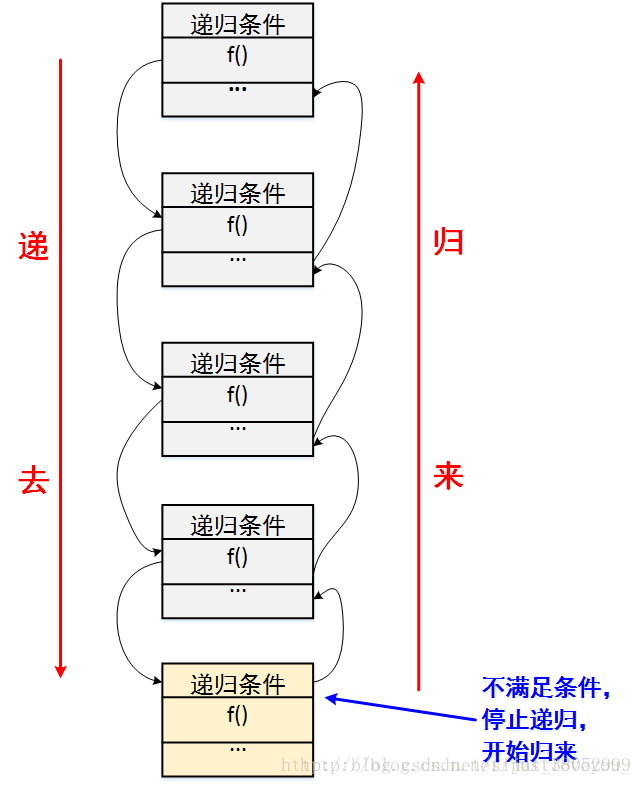

# JavaScript 递归算法
> 递归算法（英语：recursion algorithm）在计算机科学中是指一种通过重复将问题分解为同类的子问题而解决问题的方法。递归算法思想与[分治算法」「深度优先遍历」等算法，以及数据结构「栈」「堆」紧密不可分。递归算法是妙不可言，我们经常惊叹于递归编写代码的简洁，但真正领悟递归的精髓并不是一件简单的事。

> 在开始之前，我们先来了解下递归算法中的几个概念。

## 递归的内涵

### 1、递归的思想

递归就是有去（递去）有回（归来），如下图所示。“有去”是指：递归问题必须可以分解为若干个规模较小，与原问题形式相同的子问题，这些子问题可以用相同的解题思路来解决，“有回”是指 : 这些问题的演化过程是一个从大到小，由近及远的过程，并且会有一个明确的终点(临界点)，一旦到达了这个临界点，就不用再往更小、更远的地方走下去。最后，从这个临界点开始，原路返回到原点，原问题解决。


### 2.数学归纳法理解递归

递归用数学模型理解，是一个归纳总结的思想。数学归纳法适合于将问题分解为多个小问题，再来解决能够解决的小问题，也和分治的思想不谋而合。绝大部分情况下分治算法都是通过递归实现，即子问题的求解通过递归方法实现。

### 3.递归拆分

递归可以基于「自顶向下」拆分问题，再「自底向上」逐层解决问题。这也是所熟知的「分而治之」的算法思想

## 递归与迭代
在递归的过程中会伴随这迭代，绝大多数递归可以用`whlie`或者`for`循环实现，理论上递归和迭代时间复杂度方面是一样的，但实际应用中（函数调用和函数调用堆栈的开销）递归比迭代效率要低。一般递归可以转化为迭代，迭代也可以转递归。
转换方式有：
- 1.直接转化法，直接求值，不需要回溯，即「归来」
- 2.间接转化，不能直接迭代，需要回溯，可以用「栈」实现

[参考实例](assets/doc/509斐波那契数.md)

## 递归函数调用栈
我们常遇到递归的深度过大，算法的空间复杂度会很大，甚至导致栈溢出，浏览器内存溢出，陷入死循环。

## 递归函数解决步骤

递归思想分为如下三步： 
- 1.拆分问题，找到递推方程式 
- 2.解决子问题，即找到临界值，确定递归的出口 
- 3.合并问题，将子问题得到的解合并到总解上。

## 数学建模

```js
/**

* 递归算法

* @param data 问题的规模，逐步缩小问题规模

* @param 问题的解

*/

function recursion(data) {
  if (end_condition) {
    // 明确的递归终止条件

    end; // 简单情景
  } else {
    // 在将问题转换为子问题的每一步，解决该步中剩余部分的问题

    solve; // 递去，自顶向下

    recursion(data); // 递到最深处后，不断地归来

    solve other// 归来，自底向上
  }
}
```

## 案例解析

- [509.斐波那契数](assets/doc/509斐波那契数.md)
- [326.3的幂](assets/doc/326.3的幂.md)
- [206.反转链表](assets/doc/206反转链表.md)
- [归并排序](assets/doc/归并排序.md)

## 结束

完整的代码在我的 Github 上，欢迎下载，欢迎 Star！

各位大佬提Issues，我们可以一起讨论更多有关递归，或者其他算法的问题。
