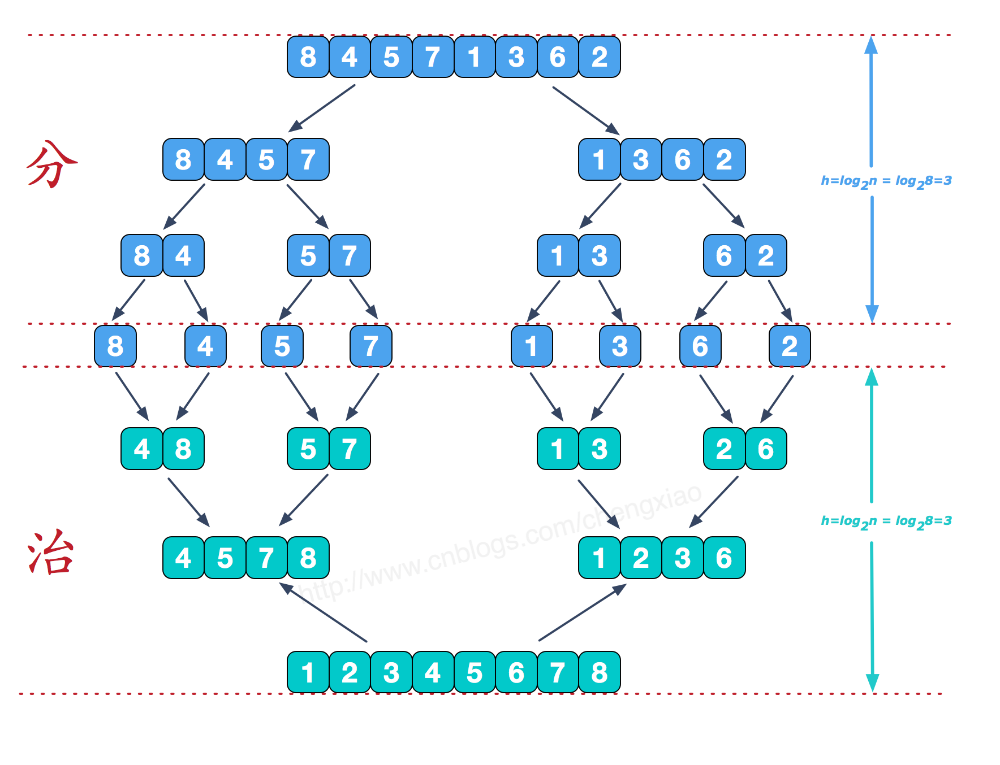
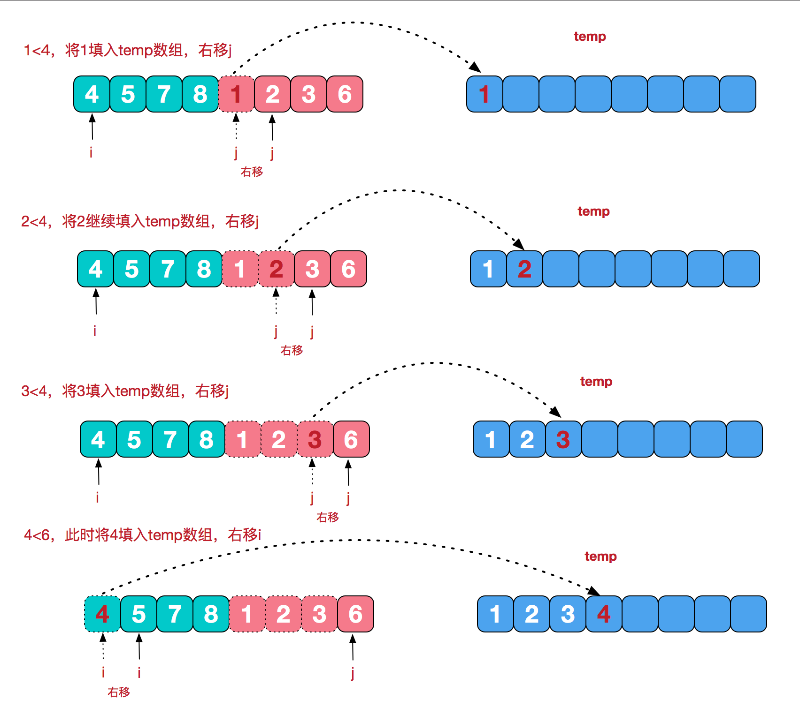

# 递归案例
## 归并排序
归并排序（MERGE-SORT）是利用归并的思想实现的排序方法，该算法采用经典的分治（divide-and-conquer）策略（分治法将问题分(divide)成一些小的问题然后递归求解，而治(conquer)的阶段则将分的阶段得到的各答案"修补"在一起，即分而治之)。

### 示例 1：
```
输入：arr = [8,4,5,7,1,3,6,2]]
输出：[1,2,3,4,5,6,7,8]
解释：升序排列
```

## 题解
### 1.示例图



### 2.代码
```js
let dat=[5, 8, 10, 3, 2, 18, 17, 9];
        function merge(left,right){
            var temp=[];
            while(left.length&&right.length){
                if(left[0]<right[0]){
                    temp.push(left.shift());
                }else{
                    temp.push(right.shift());
                }
            }
            //left和right长度不一样时，直接连接剩下的长的部分（本身有序）
            return temp.concat(left,right);

        }
        function mergeSort(data){
            if(data.length<=1){
                return data;
            }
            var mid=Math.floor(data.length/2);
            var left=data.slice(0,mid);
            var right=data.slice(mid);
       
            return  merge(mergeSort(left),mergeSort(right));
        }
        var sortedData=mergeSort(dat);
        console.log(sortedData);
```

### 3.时间复杂度

时间复杂度O(nlog2n): 最坏时间为nlog2n
空间复杂度O(n): 递归调用n个栈

